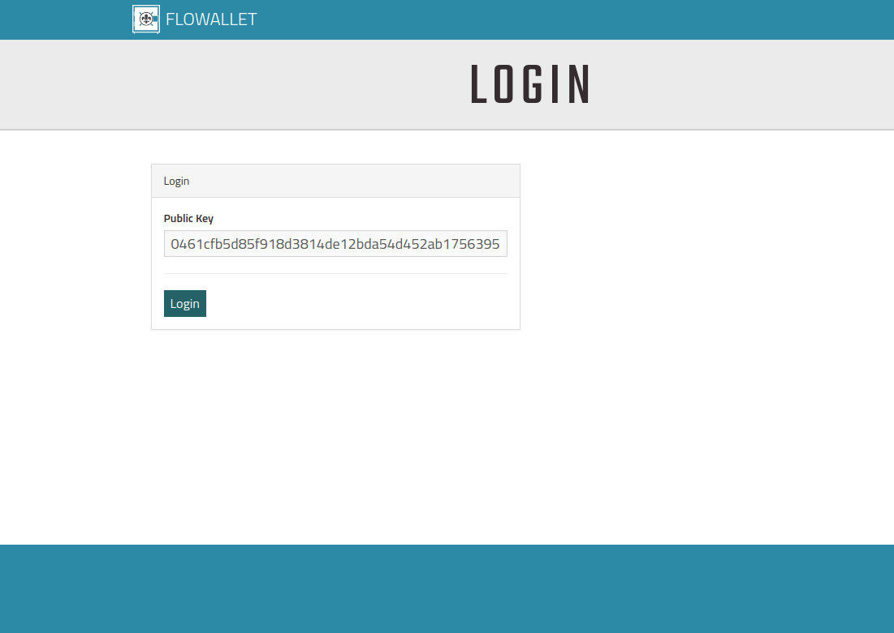
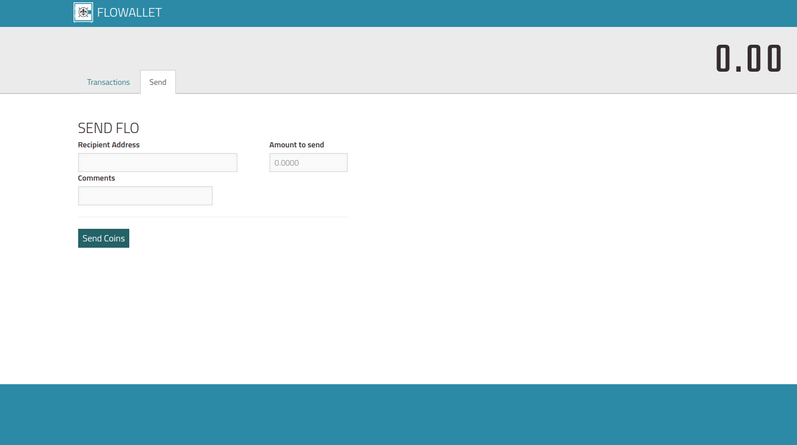
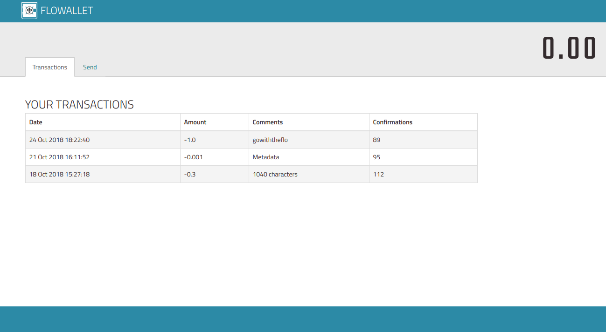

Flowallet is a web browser based software used for sending FLO (crypto coins) into the crypto account (address) of another user. This is called a transaction.
You can also add comments to a transaction.

User has to open the software using a URL in a web browser. Login is performed after that.

More details are mentioned in the "How to use ?" section below.

Flowallet connects to the local flocore wallet and communicates with it to perform transactions and data fetch.

Flowallet is accessed through URL. To make this possible NodeJS is used.
The server is in NodeJS. This allows us to use bitcoin JS libraries on the server side. On top of this, NodeJS is well known enough that others can easily contribute.

## Installation for Windows

### Prerequisites

Following softwares are required for the installation process :

		Flocore wallet, Github, NPM, NodeJS

Flocore wallet exe can be downloaded from the following link:
	https://www.flo.cash/

After installing above from the exe start the flo daemon `flod` from the command prompt so that the wallet service starts running in the background.

Github can be installed from following link :
	https://git-scm.com/download/win
	
NodeJS and NPM :  http://blog.teamtreehouse.com/install-node-js-npm-windows

### Process

Flowallet can be installed by running window.bat from command prompt. File is present in Installers folder.

## Installation for Ubuntu

### Prerequisites

Following softwares are required for the installation process :

		Flocore wallet, Github, NPM, NodeJS

Flocore wallet exe can be downloaded from the following link:
	https://www.flo.cash/
	
After installing flocore from the executable start the flo daemon `flod` from the terminal so that the wallet service starts running in the background.

Github can be installed from following link :
	https://git-scm.com/download/linux
	
NodeJS and NPM :  https://www.digitalocean.com/community/tutorials/how-to-install-node-js-on-ubuntu-16-04

### Process

Flowallet can be installed by running linux.sh from the terminal. File is present in Installers folder.

How to use ?
--------------

After successfully performing the installation open the link http://localhost:3000 in browser.

Login page is loaded. User has to put a valid public key and press login button. Screenshot is shown below.

The generation of public and private key pair is explained after this section.

For convenience a default public key is hardcoded in the login page. So just press login button and below page is loaded.

The loaded page has 2 tabs and FLO balance on the top right side.

The default tab (Send) is having the "Send FLO" functionality. As seen in the image above it takes the recipient's address, amount of FLO and comment as the input. Pressing the "Send Coins" button sends the entered FLO amount to the recipient.

Other tab (Transactions) displays the transaction history in reverse chronological order i.e the latest transactions are shown first.
Infinite scrolling is enabled which means user can keep on scrolling till there are no more records. Screenshot is shown below.

The FLO balance is shown in the top right side in large font size. It is dynamically updated i.e the balance will be updated at runtime when the "Send Coins" button is pressed and transaction is successful.

Generation and storage of key pairs
---------------------------------------

Public and Private key pair is generated using crypto and eccrypto NodeJS packages. Code is shown below.
	
	var crypto   = require("crypto");
	var eccrypto = require("eccrypto");

	// A new random 32-byte private key. 
       var privateKey = crypto.randomBytes(32).toString("hex");
	   
    // Corresponding uncompressed (65-byte) public key. 
       var publicKey = eccrypto.getPublic(privateKey).toString("hex");

After generation the key pair is stored in `public/keys.txt` separated by a delimiter (:).  
Storage is done manually i.e opening the above text file and adding the key pair in the format `public_key:private_key`

After storage the public key is used for login.
